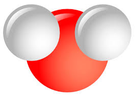

# $mol(ecule)
$mol - next gen stateful reactive micromodular ui framework. Very simple, but very powerful.

* [Quick start with PMS architecture](https://github.com/nin-jin/pms-stub)

## Basic molecules

 * [$mol_model](model) - abstract reactive model
 * [$mol_view](view) - abstract reactive view model 
 * [$mol_filler](filler) - lorem ipsum

## Simple controls

 * [$mol_clicker](clicker) - button
 * [$mol_checker](checker) - checkbox
 * [$mol_switcher](switcher) - radio button
 * [$mol_stringer](stringer) - one string input
 * [$mol_number](number) - number input

## Layout molecules

 * [$mol_scroller](scroller) - scrolling panel
 * [$mol_rower](rower) - multiple columns 
 * [$mol_lister](lister) - list of rows with lazy rendering 
 * [$mol_tabler](tabler) - grid with lazy rendering 
 * [$mol_floater](floater) - float block 
 * [$mol_panel](panel) - head-body-foot panel
 * [$mol_spoiler](spoiler) - expandable block

## Demo applications

 * [$mol_app_demo](app/demo) - demonstrates all molecules ([online](http://nin-jin.github.io/mol/))
 * [$mol_app_todo](app/todo) - TodoMVC ([online](http://nin-jin.github.io/todomvc/examples/mol/), [benchmark](https://github.com/nin-jin/todomvc/tree/master/benchmark))
 * [$mol_app_calc](app/calc) - simple spreadsheet ([online](http://nin-jin.github.io/calc/))
